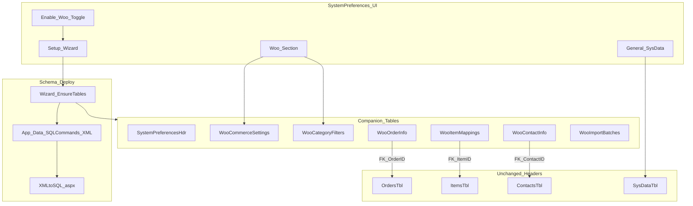

# WooCommerce Integration Plan (TrackerSQL 3.0.1.0)

## Locked decisions

| Topic | Decision |
|-------|----------|
| Version | **3.0.1.0** (branch from live baseline `26f7411` / Release 3.0.0.5) |
| Catalog sync | **Hybrid (1C):** pull Woo products/variants for mapping; push Tracker **enabled/disabled** only (no stock qty in this version) |
| Credentials | **DB + AES encrypt/decrypt** — app crypto key in config (`WooCommerceCryptoKey`); ciphertext in DB; never log plaintext |
| Header tables | **No new columns** on `OrdersTbl`, `ItemsTbl`, or `ContactsTbl`. All Woo/extra data in **companion tables** keyed by header PK so orders/items/contacts keep working standalone |
| Schema deploy | New tables delivered as **`App_Data` SQLCommands XML** runnable via [`Tools/XMLtoSQL.aspx`](Tools/XMLtoSQL.aspx); setup wizard runs/ensures those creates. Keep **TrackerMigration** aligned for greenfield (Rule #0d) — do not invent parallel Migrate_* scripts under TrackerSQL |
| System Data | **Replace** with **System Preferences** (no redirect): retitle page/menu/tools card; same tool slot becomes the preferences shell |
| Woo enable | **Enable WooCommerce integration** toggle starts a **setup wizard** that creates support/preference/companion tables (if missing) and walks initial URL/keys/categories |
| UI / user messages | All user-facing UI copy (labels, wizard steps, Woo-site setup instructions, errors, status) in **`Resources/Messages.resx`** (+ `MessageKeys` / `MessageProvider`) unless a rare hot-path shows measurable cost — see Implementation notes |
| Test connection | **Required in setup wizard and Woo Preferences** — REST ping after keys saved; clear success/fail messages from Messages.resx |
| Categories | Sync **include/exclude** category lists in Woo prefs; **default = all** at setup |
| Guest / sundry | Guest checkout and configured Woo categories → Tracker **ZZName** (`SundryCustomerID` / `ZZName`) |
| Payment / on-hold | Woo `on-hold` ≈ pending payment (e.g. EFT); payment state editable on the Woo order companion / Order Detail Woo panel |
| Dispatched | Woo has no native “dispatched”; do **not** push “completed/done” at dispatch. Prefer custom status/meta or `processing` + note; collect **tracking number** when delivery method is dispatch-linked (prefs replace hardcoded Courier/ParcelDispatch mapping) |
| Access | **Administrators only** for Preferences, wizard, imports, mapping sync |
| Connection model | **One store-level** Woo REST connection (not per Tracker login). WordPress key user should be a dedicated integration account |
| User tracking (both sides) | **Yes — audit, not per-user API keys.** See [User change tracking](#user-change-tracking-both-sides) |
| Webhooks | **Later phase** — 3.0.1.0 is on-demand + cursor pull |
| Docs | [`Documentation/WooIntegration/`](Documentation/WooIntegration/) |

### User change tracking (both sides)

Keep a **single** encrypted Woo connection. Attribute actions as follows:

| Side | What is recorded |
|------|------------------|
| **Tracker** | `UpdatedBy` / `CreatedBy` on prefs, settings, import batches; `woo.log` entries include the ASP.NET logged-in user; later order/item sync actions log Tracker username |
| **WooCommerce** | REST calls authenticate as the **WordPress integration user** on the API key (shows in Woo as that WP user). Additionally, when Tracker pushes status/notes, add an order note / meta: `Updated from Tracker by {TrackerUser}` so shop admins see the human actor |

Do **not** create a separate Woo consumer key per Tracker user. That complicates revoke/rotation and does not improve shop-side clarity beyond notes + Tracker audit.

**Encrypt/decrypt:** Yes — `WooCommerceSecretProtector` (AES). Rotate crypto key → re-enter Woo secrets in Preferences.

---

## Design principles (from review)

1. **Companion tables only** — e.g. `WooOrderInfoTbl.OrderID → OrdersTbl.OrderID`, `WooItemInfoTbl.ItemID → ItemsTbl.ItemID`. Deleting Woo tables must not break core order/item flows.
2. **XMLtoSQL-first DDL** — every new table ships as XML `<command type="create">` (and verify `select`s) under `App_Data`, executable by XMLtoSQL; wizard can invoke the same ensure-schema path.
3. **System Preferences replaces System Data** — General section hosts today’s `SysDataTbl` fields; Woo is a **linked companion** section visible when integration is enabled (or during wizard).
4. **Standalone core** — non-Woo sites never require Woo tables until Enable + wizard runs.

---

## Current codebase anchors

- System Data: [`Tools/SystemData.aspx`](Tools/SystemData.aspx) + [`SysDataRepository`](Repositories/SysDataRepository.cs) — **replace** UI with System Preferences (update [`Site.Master`](Site.Master), [`SystemTools.aspx`](Tools/SystemTools.aspx)).
- ZZName / sundry: [`SystemConstants.CustomerConstants.SundryCustomerID = 9`](Classes/SystemConstants.cs), name `ZZName`.
- Dispatch wording hardcoded: [`OrderDetailManager.GetStatusKeyFromDeliveryPersonId`](Managers/OrderDetailManager%20.cs) and [`OrderDone.aspx.cs`](Pages/OrderDone.aspx.cs) map `CourierDeliveryID` / `ParcelDispatchID` → `StatusDispatched` — **move to preferences**.
- Orders create: [`OrderManager.EnsureOrderHeader`](Managers/OrderManager.cs) + `AddOrderLineToOrder`.
- Schema tool: [`Tools/XMLtoSQL.aspx`](Tools/XMLtoSQL.aspx) + samples like [`App_Data/SQLCommands-HolidayClosure-01.xml`](App_Data/SQLCommands-HolidayClosure-01.xml).

---

## Target architecture

### Proposed tables (companions — no Orders/Items/Contacts column adds)

**A. Preferences shell**

1. **`SystemPreferencesHdrTbl`** (singleton or keyed header)  
   - Marks which optional modules are enabled (`WooCommerceEnabled`, etc.), wizard completed flags, timestamps.

2. **`SysDataTbl`** — **unchanged** columns; still edited under Preferences → General.

**B. Woo module (created by wizard / XMLtoSQL pack)**

3. **`WooCommerceSettingsTbl`** (1:1 with prefs header or singleton)  
   - Store URL, Admin URL, Consumer Key/Secret (**encrypted**), `IntegrationEnabled`.  
   - Cursors: `LastItemsSyncUtc`, `LastOrdersSyncUtc`, `LastOrdersSyncOrderNumber`, `LastContactsSyncUtc`.  
   - Behaviour: `PushEnabledStateToWoo`, default `DisableScope`, `PullStockQtyEnabled` stub (off).  
   - Category mode: `CategoryFilterMode` (`All` | `IncludeList` | `ExcludeList`).  
   - Contact routing: `GuestCheckoutContactMode` = ZZName; category→ZZName rules reference.  
   - Status/dispatch prefs: which Tracker delivery-person IDs mean “dispatch”, whether tracking # is required, Woo target status for dispatched (custom slug/meta vs keep `processing`), whether Done→Woo `completed` is automatic.  
   - Payment: treat `on-hold` as awaiting payment; allow manual “mark paid / confirm” from Tracker.

4. **`WooCategoryFilterTbl`**  
   - `WooCategoryId`, `Name`, `ParentWooCategoryId`, `IncludeInSync` (ZZName routing is decided at order import, not on categories).

5. **`WooItemMappingsTbl`**  
   - `ItemID` → Items PK; `WooProductId`, `WooVariationId`, `MapType`, `SkuPattern`, `QtyFactor`, `PackagingID`, `DisableScope`, sync metadata.  
   - Optional slim **`WooItemInfoTbl`** only if we need item-level Woo cache without touching `ItemsTbl`.

6. **`WooAttributeMapTbl`** — Woo variation attribute name/option → Tracker qty factor + packaging (replaces SKU wildcards).
7. **`WooPackagingServiceTypeTbl`** — optional companion filter: packaging allowed per ItemServiceType (empty = all).

7. **`WooOrderInfoTbl`** (companion to `OrdersTbl`)  
   - PK/FK `OrderID`; `WooOrderId` (unique), `WooOrderNumber`, `WooStatus`, `PaymentMethod`, `PaymentStatus` / `PaymentPaid`, `TrackingNumber`, `LastSyncedUtc`, snapshot fields as needed.  
   - **No** reliance on new `OrdersTbl` columns; optional human-visible reuse of existing `PurchaseOrder` only if useful (not required).

8. **`WooContactInfoTbl`** — FK `ContactID`; `WooCustomerId`, `MatchEmail`, `LastSyncedUtc`.

9. **`WooImportBatchesTbl` / `WooImportBatchLinesTbl`** — staged order/contact imports.

**XML pack example name:** `App_Data/SQLCommands-WooCommerce-01.xml` (create tables + indexes + verify selects). Wizard “Ensure schema” runs the same creates idempotently (IF NOT EXISTS / check catalog).

---

## UI / product shape

### System Preferences (replaces System Data — no redirect)

- Replace [`SystemData.aspx`](Tools/SystemData.aspx) with **System Preferences** (file rename or in-place replace of title/content; update all menu/tool links to the new name — **no** temporary redirect page).
- Layout: **sidebar** (preferred) or tabs: **General** | **WooCommerce** (section enabled/visible after Enable + wizard, or always with Enable control at top).
- **Enable WooCommerce integration** → launches **setup wizard**:  
  1) **Woo site prep** — instructional text (Messages.resx) covering: enable pretty permalinks / REST; WooCommerce → Settings → Advanced → REST API → add key (Read/Write); copy Consumer key/secret; note store base URL (e.g. `https://shop.example.com`); optional admin deep-link base; HTTPS required  
  2) Ensure schema (XML/wizard creates)  
  3) Store URL + Consumer key/secret (encrypt)  
  4) **Test Connection** (mandatory before Finish; also available later on Woo Preferences) — `GET` products or system status; show success/failure from Messages.resx (no secret echo)  
  5) Admin URL  
  6) Category default **All**, then optional include/exclude + ZZName category flags  
  7) Dispatch delivery-person IDs + tracking required  
  8) Finish → `WooCommerceEnabled = true` (blocked until Test Connection succeeds once in this session, or prefs allow re-test)
- Menu/tools: System Tools card + Site.Master “System Data” → **System Preferences**.

### Category-aware product sync

- Preferences store which Woo categories are in scope (all / include / exclude).
- Pull catalog only for in-scope categories (and their products/variations).
- Mapping UI filters to those categories; show category on each Woo product row.

### Item mapping + enabled sync

- Unchanged intent: 1-1 and SKU wildcards (e.g. `9QRCcoDec*` + `250g` → 0.25 + packaging).
- Disable scope per mapping for variants; preference default.
- Push enabled/disabled only; stock qty later.

### Order import (staged)

- Preview then confirm.
- Contact resolution order: linked Woo customer → email match → **guest or ZZName-routed category** → `SundryCustomerID` / ZZName with walk-in name in Notes (existing ZZName patterns) → else propose new contact.
- Payment: import `on-hold` as awaiting payment on `WooOrderInfoTbl`; user can mark paid / move status from Order Detail Woo panel (EFT use case).

### Order Detail Woo panel (companion-driven)

- Show only when `WooOrderInfoTbl` row exists for `OrderID`.
- Woo # + admin link, status, payment (editable), tracking number, last synced.
- **Refresh from Woo**, **Open in Woo admin**, **Retrieve latest for contact** → staged preview.
- When delivery method is dispatch-linked (prefs): prompt/require **tracking number** before pushing dispatched state to Woo.

### Status bridge (updated)

| Tracker event | Woo | Notes |
|---------------|-----|--------|
| Imported / awaiting payment | `on-hold` / `pending` | Payment editable in Tracker companion |
| Confirmed / paid | `processing` | |
| **Dispatched** (courier/parcel per prefs) | Not `completed` — custom status or `processing` + tracking meta | Ask for tracking # |
| **Done** (delivered/collected complete) | `completed` | Only on true Done; pref if auto from Woo |
| Cancelled | `cancelled` | |

Replace hardcoded delivery-person→message mapping with **System Preferences → Dispatch** lists (seed defaults: current Courier=7, ParcelDispatch=5, Collection=6 behaviour).

### Contact sync

- Staged; last N days or one customer; companion `WooContactInfoTbl` only.

---

## Considerations (updated)

- Idempotency on `WooOrderId`; unmapped SKUs block preview rows.
- Guest + category ZZName → sundry; do not create duplicate Contacts unless user chooses “create contact”.
- Admin role gate on Preferences, wizard, imports, mapping sync.
- Webhooks deferred.
- Partial refunds: show on panel; no auto-delete.
- `woo.log` without secrets.
- Crypto key loss → re-enter secrets.
- Core orders/items remain usable if Woo tables absent (feature off).

---

## Phases and test gates

### Phase 0 — Branch + docs
- Branch `feature/woocommerce-3.0.1.0` from live baseline.
- Write `Documentation/WooIntegration/` (README, PLAN_3.0.1.0, STATUS); link INDEX.
- **Test:** docs linked; branch builds; no behaviour change.

### Phase 1 — System Preferences replace + Enable wizard + schema XML
- Replace System Data UI/name with System Preferences (General = SysData).
- Enable Woo + setup wizard including **Woo-site setup instructions** and **Test Connection** button (wizard + Woo section).
- All new UI/user strings via **Messages.resx** / MessageKeys (wizard body, button labels, connection OK/fail).
- `SQLCommands-WooCommerce-01.xml` + wizard Ensure schema; `WooCommerceSettingsTbl` + encrypted secrets; admin-only.
- **Test:** System Data links → Preferences; wizard shows Woo prep steps; Test Connection succeeds/fails clearly; Finish gated on successful test; tables via XML path; keys masked; Woo-off site unaffected; General SysData still works.

### Phase 2 — Categories + item mapping + enabled sync
- Category filter prefs (default all; include/exclude; ZZName flags stored).
- Pull scoped catalog; mappings + wildcards; enabled push + disable scope.
- **Test:** exclude category omitted from pull; ZZName flag stored; 1-1 and wildcard qty/packaging; variant disable scope; no stock qty API writes.

### Phase 3 — Staged order import + payment/on-hold
- Import preview/confirm; write `WooOrderInfoTbl` only (no OrdersTbl alters).
- Guest → ZZName; category RouteToZzName → ZZName; email match otherwise.
- on-hold → payment pending on companion; editable before/at confirm.
- **Test:** preview no writes; confirm once; re-import idempotent; guest is ZZName Notes pattern; EFT on-hold editable; unmapped SKU blocks.

### Phase 4 — Order Detail companion panel + tracking field
- Panel from `WooOrderInfoTbl`; admin link; refresh; retrieve latest.
- Tracking number field on companion; UI when dispatch-linked.
- **Test:** non-Woo orders unchanged; panel hidden without companion row; tracking saves on companion only.

### Phase 5 — Status bridge + dispatch prefs (un-hardcode)
- Prefs for which `ToBeDeliveredByID`s are dispatch/collection; require tracking; Woo dispatched ≠ completed.
- Hook Confirmed / Dispatched / Done; migrate logic out of hardcoded switches in OrderDetailManager / OrderDone.
- **Test:** dispatch asks tracking; Woo not marked completed on dispatch; Done→completed; on-hold payment confirm→processing; prefs change delivery IDs without code edit.

### Phase 6 — Staged contact import
- Last N days / single; `WooContactInfoTbl` only.
- **Test:** email match/link; ambiguous choice; idempotent.

### Phase 7 — Hardening / release 3.0.1.0
- Admin checks everywhere; logging; runbook; `websample.config` crypto placeholder; UAT; release notes.
- **Test:** E2E guest ZZName order; EFT on-hold→paid→process→dispatch+tracking→Done→Woo completed; disable item→Woo variants per scope; Woo-disabled site still takes normal orders.

---

## Implementation notes

- Repositories/managers only; WebForms UI standards; Recurring/Preparation naming.
- Companion FKs optional-safe: app checks Woo enabled + table exists before join.
- DDL: XMLtoSQL packs + wizard ensure; mirror creates into TrackerMigration for new environments.
- Do not add Migrate_* under TrackerSQL legacy folders.
- **Messages.resx:** Prefer `MessageProvider.Get` / `MessageKeys` for every user-visible Woo/Preferences string (including multi-paragraph wizard help). This matches existing email/UI patterns and is **not** expected to slow the app (resources are cached by the runtime). **Exception note:** only if profiling shows a hot loop calling Get thousands of times per request, cache the string once in the page/manager — do not hardcode UI English in `.aspx`/`.cs` as the default.
- **Test Connection:** shared helper used by wizard step and Preferences Woo section; logs outcome to `woo.log` without credentials.

---

## Execution intent

- **Yes — Phase 0 then Phase 1** on branch `feature/woocommerce-3.0.1.0` from live baseline `26f7411`.
- Start when Agent mode is approved: docs → branch → Preferences replace → wizard (Woo prep copy + Test Connection) → XML schema + encrypted settings.

## First execution step (when Agent mode approved)

1. Create `Documentation/WooIntegration/` with README, PLAN_3.0.1.0 (this plan), STATUS; update `Documentation/INDEX.md`.
2. Create branch `feature/woocommerce-3.0.1.0` from `26f7411` (or current live tip if still that commit).
3. Begin Phase 1 implementation (Preferences + wizard + Test Connection + Messages.resx + schema XML).
